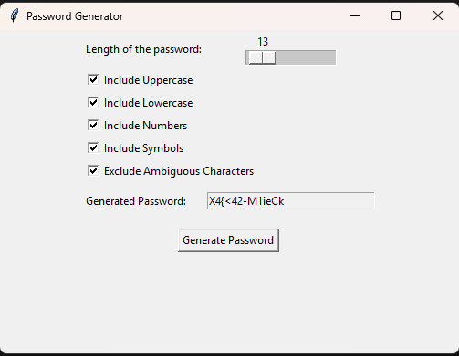

Here's your README content, ready to copy-paste:

markdown# Python Password Security Toolkit

A collection of educational security tools built in Python that demonstrate 
real-world password attack techniques, secure password generation, and 
encrypted credential storage. Built as part of a cybersecurity portfolio 
to explore how passwords are cracked and how to defend against it.

> **Ethical Use Only.** See [DISCLAIMER.md](DISCLAIMER.md) for full terms.
> These tools are for educational purposes and authorized testing only.

---

## Tools

### 1. Password Cracker (`cracker/cracker.py`)

Demonstrates three attack methodologies used in real-world penetration testing 
and security audits against hashed passwords.

**Attack Types:**

- **Dictionary Attack:** Reads a wordlist line by line (rockyou.txt compatible), 
  hashes each entry, and compares against the target hash. Fast and effective 
  against weak or common passwords.

- **Brute Force Attack:** Generates every possible character combination up to 
  a specified length using itertools.product. Guaranteed to find the password 
  eventually but exponentially slower as length increases.

- **Hybrid Attack:** Combines dictionary and brute force. Takes each word from 
  a wordlist and appends generated character combinations as suffixes. Effective 
  against passwords like "password123" or "admin2024".

**Supported Hash Algorithms:** MD5, SHA1, SHA256, SHA512

**Usage:**
```bash
python cracker/cracker.py
```
Enter the target hash: 5e884898da28047151d0e56f8dc6292773603d0d7aabbde1083
Enter the algorithm: sha256
Choose attack type (1 for Dictionary, 2 for Brute Force, 3 for Hybrid): 1
Enter the dictionary file: wordlists/rockyou.txt
Password found: password

---

### 2. Password Generator (`generator/generator.py`)

A Tkinter GUI tool for generating cryptographically random passwords with 
fine-grained control over character composition.

**Features:**

- Adjustable length from 4 to 200 characters via slider
- Toggle uppercase, lowercase, numbers, and symbols independently
- Excludes ambiguous characters (O, 0, I, l, 1, |) to avoid confusion
- Guarantees at least one character from each selected type
- Saves generated password to `demo/passwordgenerator.txt`

**Usage:**
```bash
python generator/generator.py
```



---

### 3. Password Manager (`manager/manager.py`)

A locally encrypted CLI password manager that stores credentials in an 
AES-encrypted vault using the `cryptography` library.

**Security Design:**

- Master password is never stored anywhere, only its SHA256 hash is saved 
  for verification
- All stored credentials are encrypted with Fernet (AES-128-CBC) symmetric 
  encryption before being written to `vault.json`
- Vault file is unreadable without the correct master password

**Features:**

- Add credentials (site, username, password)
- Retrieve a password by site name
- List all stored sites
- Delete a credential entry
- Master password setup on first run, verification on every subsequent run

**Usage:**
```bash
python manager/manager.py
```
Welcome to Password Manager
Set your master password: ••••••••
Master password set.
Options: add | get | list | delete | quit

add
Site: github.com
Username: akshitjindal
Password: ••••••••
Saved.


get
Site: github.com
Username: akshitjindal
Password: MySecurePass123!


---

## Project Structure
python-password-toolkit/
├── cracker/
│   ├── init.py
│   └── cracker.py          # Dictionary, brute force, hybrid attack engine
├── generator/
│   ├── init.py
│   └── generator.py        # Tkinter GUI password generator
├── manager/
│   ├── init.py
│   └── manager.py          # Fernet-encrypted CLI password manager
├── wordlists/
│   └── README.md           # Instructions for adding rockyou.txt
├── demo/
│   └── screenshots/        # GUI and terminal output screenshots
├── DISCLAIMER.md
├── requirements.txt
└── README.md

---

## Installation

```bash
# Clone the repo
git clone https://github.com/yourusername/python-password-toolkit.git
cd python-password-toolkit

# Install dependencies
pip install -r requirements.txt

# tkinter comes with Python by default
# If missing on Linux: sudo apt-get install python3-tk
```

---

## Wordlist Setup

The cracker supports any newline-separated wordlist. rockyou.txt is not 
included in this repo due to its size. To use it:

1. Download rockyou.txt from a trusted source
2. Place it inside the `wordlists/` folder
3. Reference it when prompted: `wordlists/rockyou.txt`

---

## Why I Built This

Understanding how passwords get cracked is the first step to understanding 
how to build systems that resist it. Each tool in this repo represents a 
real concept from the security world:

- Dictionary attacks are why NIST SP 800-63B recommends checking passwords 
  against known breached password lists
- Brute force resistance is why modern systems enforce minimum length and 
  complexity requirements
- The password manager demonstrates why encryption and hashing serve 
  different purposes, a distinction that trips up a lot of developers

---

## Security Concepts Covered

| Concept | Where It Appears |
|---|---|
| SHA256 / MD5 / SHA1 hashing | cracker.py, manager.py |
| Fernet symmetric encryption (AES) | manager.py |
| Dictionary attack | cracker.py |
| Brute force enumeration | cracker.py |
| Hybrid attack | cracker.py |
| Ambiguous character exclusion | generator.py |
| Secure credential storage design | manager.py |

---

## References

- [OWASP Password Storage Cheat Sheet](https://cheatsheetseries.owasp.org/cheatsheets/Password_Storage_Cheat_Sheet.html)
- [NIST SP 800-63B Digital Identity Guidelines](https://pages.nist.gov/800-63-3/sp800-63b.html)
- [OWASP Testing Guide: Testing for Weak Password Policy](https://owasp.org/www-project-web-security-testing-guide/)
- [Have I Been Pwned: Pwned Passwords](https://haveibeenpwned.com/Passwords)

---

## Tech Stack

- Python 3.10+
- `hashlib` (stdlib) for hashing
- `itertools` (stdlib) for combination generation
- `tkinter` (stdlib) for GUI
- `cryptography` for Fernet encryption
- `getpass` (stdlib) for secure password input

---

## Author

**Akshit Jindal**  
BCIS Graduate, University of the Fraser Valley  
[GitHub](https://github.com/akshitjindal77) | [LinkedIn](https://www.linkedin.com/in/akshit-jindal)